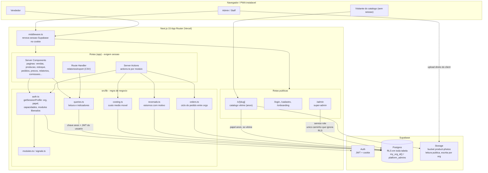
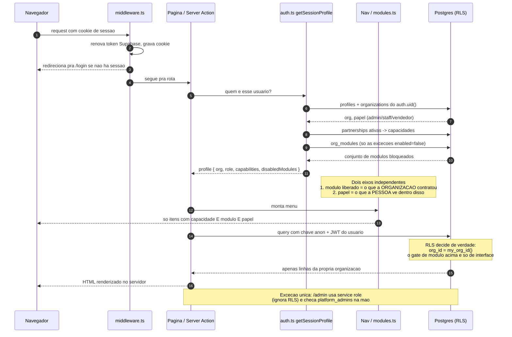
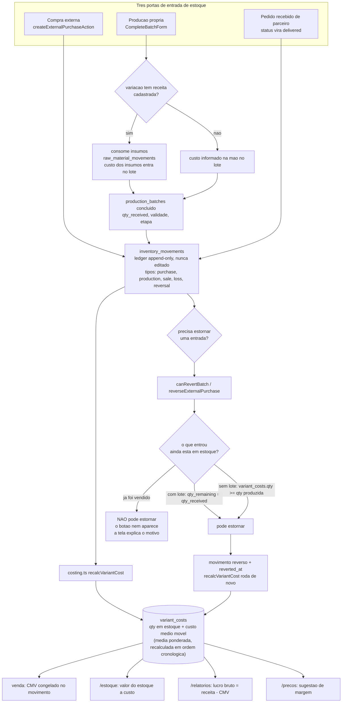
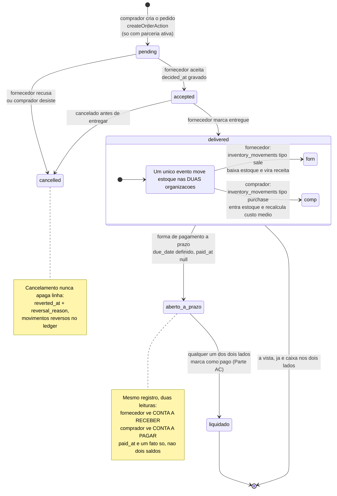
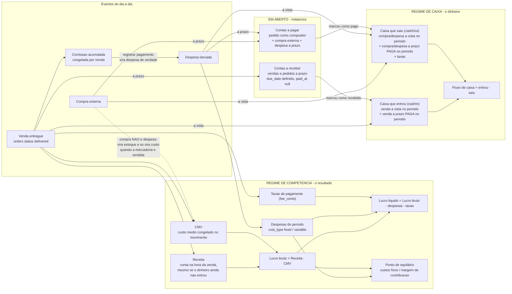

# Diagramas do Giro

Fonte dos diagramas em Mermaid. Para abrir no draw.io: **Extras → Edit Diagram**
ou **Arrange → Insert → Advanced → Mermaid**, e colar o bloco de código.
No VS Code, a extensão *Draw.io Integration* e o preview de Markdown já renderizam
direto.

São seis diagramas, não um por módulo: a maioria dos módulos segue o mesmo
desenho trivial (formulário → server action → tabela) e diagramá-los um a um só
produziria cópias que envelhecem mal. Os seis abaixo são os que carregam decisão
de arquitetura de verdade.

---

## 1. Arquitetura geral

---

## 2. Autorização e multi-tenant

Os dois eixos independentes fixados na Parte M: **módulo liberado** é o que a
organização contratou, **papel** é o que a pessoa enxerga dentro disso. O gate de
módulo é de interface; quem decide de verdade é a RLS no Postgres.

---

## 3. Fluxo de venda (PDV e lista), com comissão, taxa, prazo e estorno

```mermaid
flowchart TD
  START["Vendedor abre /vendas"] --> MODE{"Qual modo?"}
  MODE -->|"lista digitavel"| F1["NewSaleForm<br/>bom pra atacado, muitos SKUs"]
  MODE -->|"PDV em grade"| F2["PDVForm<br/>foto + carrinho, bom pra varejo"]
  F1 --> SUB["mesmo contrato de submit:<br/>variant_id[], qty[], unit_price[]"]
  F2 --> SUB
  SUB --> ACT["createSaleAction"]

  ACT --> V1{"sessao valida<br/>e tem itens?"}
  V1 -->|nao| ERR["retorna { error }<br/>ConfirmDialog mostra o motivo"]
  V1 -->|sim| PRICE["preco por canal<br/>atacado x varejo<br/>org_variant_prices"]

  PRICE --> COM["comissao CONGELADA<br/>total x commission_rate_bp do vendedor"]
  COM --> PAY{"forma de pagamento<br/>tem taxa?"}
  PAY -->|"cartao 3,5%"| FEE["fee_cents CONGELADO"]
  PAY -->|"dinheiro 0%"| FEE0["fee_cents = 0"]
  FEE --> DEF
  FEE0 --> DEF
  DEF{"forma e a prazo<br/>(is_deferred)?"}
  DEF -->|sim| DUE["due_date do formulario<br/>paid_at = null<br/>vira CONTA A RECEBER"]
  DEF -->|nao| CASH["due_date = null<br/>ja e caixa"]

  DUE --> INS
  CASH --> INS
  INS["insere orders (status delivered)<br/>+ order_items"]
  INS --> MOV["inventory_movements tipo sale<br/>qty negativa, unit_cost = custo medio atual<br/>este e o CMV congelado da venda"]
  MOV --> LOY{"fidelidade ligada<br/>e venda tem contato?"}
  LOY -->|sim| PTS["loyalty_ledger: linha positiva de pontos"]
  LOY -->|nao| DONE
  PTS --> DONE["venda concluida<br/>revalida /vendas, /estoque, /relatorios"]

  DONE --> CANC{"precisou cancelar?"}
  CANC -->|nao| FIM["fim"]
  CANC -->|sim| RV["cancelSaleAction -> reverseSale"]
  RV --> RVCHK{"ja foi revertida?"}
  RVCHK -->|sim| ERR
  RVCHK -->|nao| RVDO["movimentos reversos no ledger<br/>+ reverted_at e reversal_reason"]
  RVDO --> RVEND["nada e apagado:<br/>relatorios filtram reverted_at is null<br/>o historico continua auditavel"]
```

---

## 4. Custo médio móvel: entradas de estoque, produção e estorno

---

## 5. Pedido entre organizações (fornecedor ↔ comprador)

---

## 6. Financeiro: competência x caixa

A separação que sustenta os relatórios inteiros. Receita conta no momento da
venda; dinheiro conta quando entra de fato. Compra externa não é despesa — vira
estoque e só vira custo quando a mercadoria é vendida.

