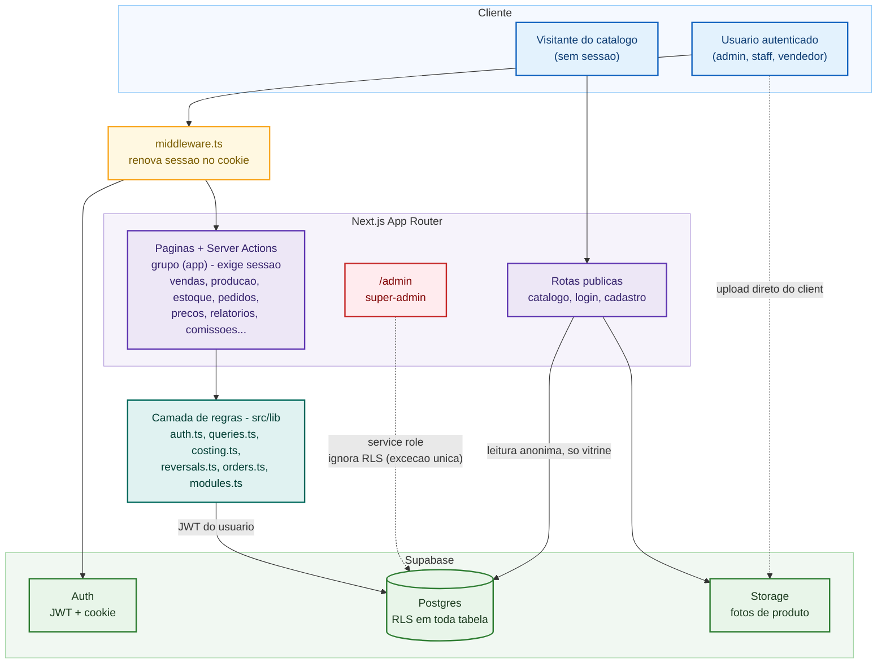
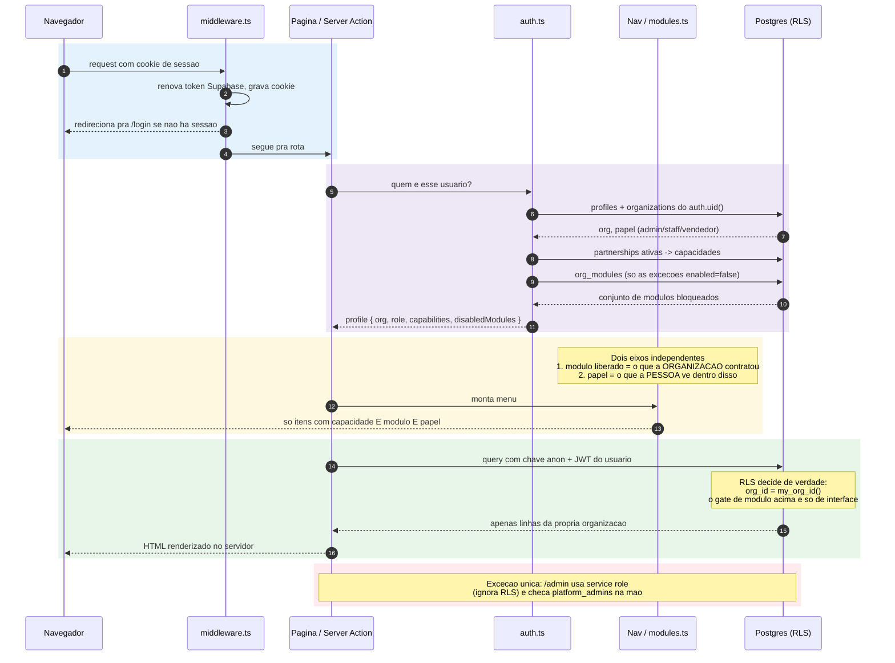
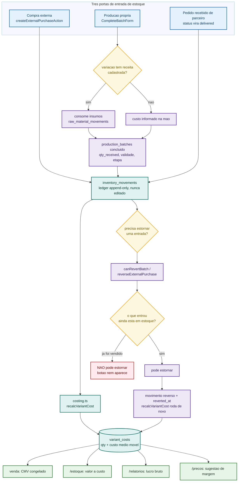
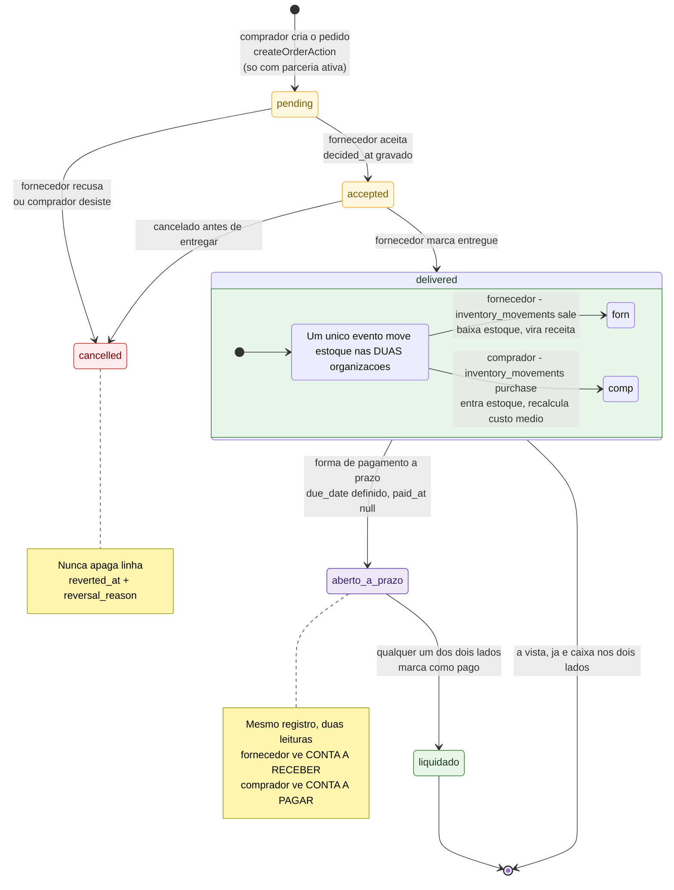
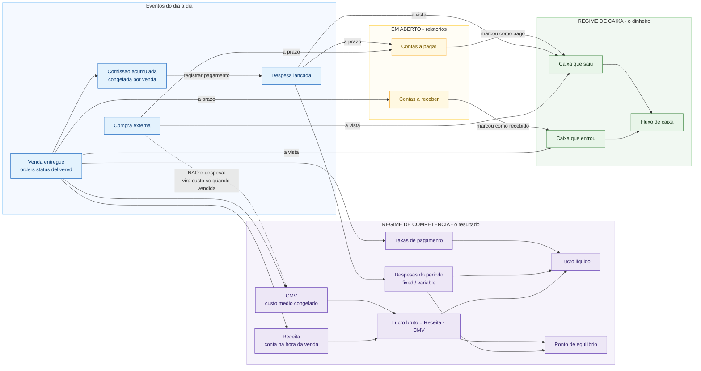
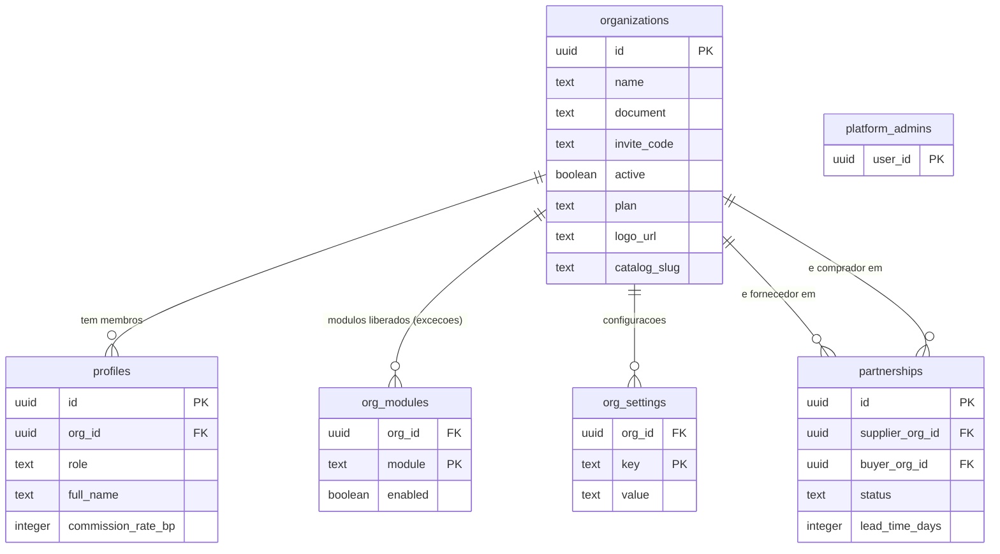
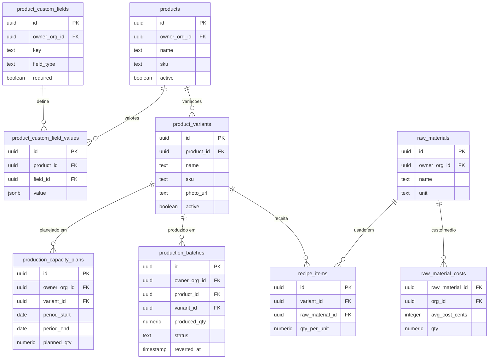
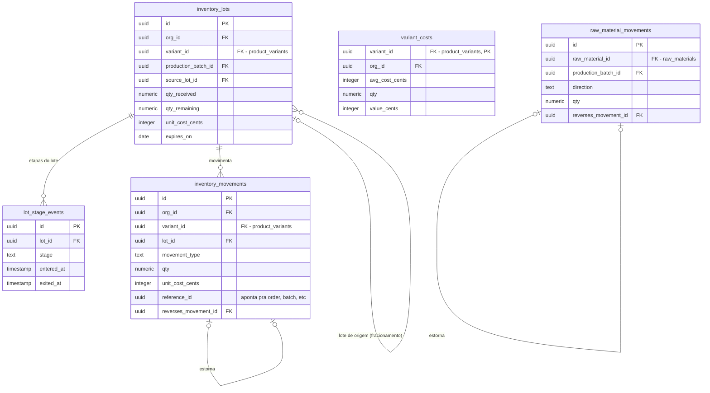
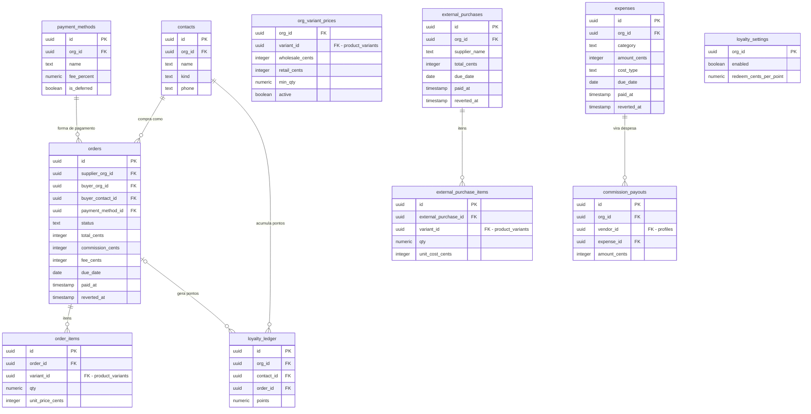

# Diagramas do Giro

Fonte dos diagramas em Mermaid. Para abrir no draw.io: **Extras → Edit Diagram**
ou **Arrange → Insert → Advanced → Mermaid**, e colar o bloco de código.
No VS Code, a extensão *Draw.io Integration* e o preview de Markdown já renderizam
direto.

Dois blocos: **fluxos** (seis diagramas, coloridos por papel semântico — decisão em
âmbar, dado/tabela em roxo/verde, bloqueio em vermelho, sucesso em verde) e
**schema** (quatro ER, um por domínio — um ER único com as 26 tabelas do banco
seria ilegível numa página só).

Não é um diagrama por módulo: a maioria segue o mesmo desenho trivial
(formulário → server action → tabela) e diagramá-los um a um só produziria
cópias que envelhecem mal. Os seis fluxos abaixo são os que carregam decisão de
arquitetura de verdade.

---

## Fluxos

### 1. Arquitetura geral

Camadas de cima para baixo: cliente → middleware → App Router → camada de regras
(`src/lib`) → Supabase. Roxo = App Router, verde-água = `src/lib`, verde = Supabase,
vermelho = o único caminho que ignora RLS (`/admin`, service role).

---

### 2. Autorização e multi-tenant

Os dois eixos independentes fixados na Parte M: **módulo liberado** é o que a
organização contratou, **papel** é o que a pessoa enxerga dentro disso. O gate de
módulo é de interface; quem decide de verdade é a RLS no Postgres. Cada faixa
colorida é uma etapa: azul = sessão, roxo = resolução de perfil, âmbar = o gate
de dois eixos, verde = RLS decidindo de verdade, vermelho = a única exceção.

---

### 3. Fluxo de venda (PDV e lista), com comissão, taxa, prazo e estorno

Azul = entrada, âmbar = decisão, roxo = processamento/congelamento de valor,
verde-água = gravação no ledger, verde = sucesso, vermelho = erro/bloqueio.

```mermaid
flowchart TD
  START["Vendedor abre /vendas"] --> MODE{"Qual modo?"}
  MODE -->|"lista digitavel"| F1["NewSaleForm<br/>bom pra atacado, muitos SKUs"]
  MODE -->|"PDV em grade"| F2["PDVForm<br/>foto + carrinho, bom pra varejo"]
  F1 --> SUB["mesmo contrato de submit:<br/>variant_id[], qty[], unit_price[]"]
  F2 --> SUB
  SUB --> ACT["createSaleAction"]

  ACT --> V1{"sessao valida<br/>e tem itens?"}
  V1 -->|nao| ERR["retorna { error }<br/>ConfirmDialog mostra o motivo"]
  V1 -->|sim| PRICE["preco por canal<br/>atacado x varejo<br/>org_variant_prices"]

  PRICE --> COM["comissao CONGELADA<br/>total x commission_rate_bp"]
  COM --> PAY{"forma de pagamento<br/>tem taxa?"}
  PAY -->|"cartao 3,5%"| FEE["fee_cents CONGELADO"]
  PAY -->|"dinheiro 0%"| FEE0["fee_cents = 0"]
  FEE --> DEF
  FEE0 --> DEF
  DEF{"forma e a prazo<br/>(is_deferred)?"}
  DEF -->|sim| DUE["due_date do formulario<br/>paid_at = null<br/>vira CONTA A RECEBER"]
  DEF -->|nao| CASH["due_date = null<br/>ja e caixa"]

  DUE --> INS
  CASH --> INS
  INS["insere orders (status delivered)<br/>+ order_items"]
  INS --> MOV["inventory_movements tipo sale<br/>qty negativa, unit_cost = custo medio<br/>este e o CMV congelado"]
  MOV --> LOY{"fidelidade ligada<br/>e venda tem contato?"}
  LOY -->|sim| PTS["loyalty_ledger:<br/>linha positiva de pontos"]
  LOY -->|nao| DONE
  PTS --> DONE["venda concluida<br/>revalida vendas, estoque, relatorios"]

  DONE --> CANC{"precisou cancelar?"}
  CANC -->|nao| FIM["fim"]
  CANC -->|sim| RV["cancelSaleAction -> reverseSale"]
  RV --> RVCHK{"ja foi revertida?"}
  RVCHK -->|sim| ERR
  RVCHK -->|nao| RVDO["movimentos reversos no ledger<br/>+ reverted_at e reversal_reason"]
  RVDO --> RVEND["nada e apagado:<br/>relatorios filtram reverted_at is null"]

  classDef startNode fill:#e3f2fd,stroke:#1565c0,stroke-width:2px,color:#0d3c73
  classDef decision fill:#fff8e1,stroke:#f9a825,stroke-width:2px,color:#7a5c00
  classDef process fill:#ede7f6,stroke:#5e35b1,stroke-width:2px,color:#33206b
  classDef data fill:#e0f2f1,stroke:#00695c,stroke-width:2px,color:#003d33
  classDef success fill:#e8f5e9,stroke:#2e7d32,stroke-width:2px,color:#1b3a1e
  classDef error fill:#ffebee,stroke:#c62828,stroke-width:2px,color:#7f0000

  class START,F1,F2,SUB startNode
  class MODE,V1,PAY,DEF,LOY,CANC,RVCHK decision
  class PRICE,COM,FEE,FEE0,DUE,CASH,RV,RVDO process
  class INS,MOV,PTS data
  class DONE,FIM,RVEND success
  class ERR error
```

---

### 4. Custo médio móvel: entradas de estoque, produção e estorno

Azul = as três portas de entrada, verde-água = ledger e custo, verde = quem
consome o custo médio, vermelho = bloqueio de estorno.

---

### 5. Pedido entre organizações (fornecedor ↔ comprador)

Âmbar = em negociação, roxo = liquidação pendente, verde = resolvido/entregue,
vermelho = cancelado.

---

### 6. Financeiro: competência x caixa

A separação que sustenta os relatórios inteiros. Receita conta no momento da
venda; dinheiro conta quando entra de fato. Compra externa não é despesa — vira
estoque e só vira custo quando a mercadoria é vendida. Azul = eventos, roxo =
regime de competência, verde = regime de caixa, âmbar = em aberto.

---

## Schema (ER por domínio)

Extraído direto do banco (`information_schema`) em 2026-09-17 — reflete as
migrations até a Parte AC. 26 tabelas no total, divididas em 4 domínios pra
cada ER caber numa página. Campos mostrados são os relevantes pra entender a
relação; nem toda coluna aparece (ex.: `created_at` é omitido quando não muda o
desenho).

### A. Identidade, acesso e parcerias

`organizations` é a raiz de tudo — toda outra tabela do sistema tem `org_id`
(direto ou via join) apontando pra cá, com RLS isolando por `org_id = my_org_id()`.
`platform_admins` não tem FK formal (referencia `auth.users`, fora do schema
`public`) — é a lista que dá acesso ao `/admin` via service role.

### B. Catálogo, insumos e produção

`product_variants` é a unidade real de venda/estoque/custo em todo o sistema —
quase tudo nos outros três domínios referencia `variant_id`, não `product_id`.

### C. Estoque e custo médio

O núcleo financeiro do sistema: `inventory_movements` é um ledger
append-only (nunca `UPDATE`/`DELETE` de linha existente — estorno é linha nova
apontando via `reverses_movement_id`), e `variant_costs` é o resultado
recalculado a partir dele (`costing.ts`). `variant_id` e `raw_material_id`
apontam pro domínio B; a linha pontilhada indica FK que cruza domínio.

### D. Comercial e financeiro

`orders` é compartilhada entre venda a contato (`buyer_contact_id`) e pedido
entre organizações (`buyer_org_id`) — por isso `due_date`/`paid_at`/`commission_cents`/
`fee_cents` servem os dois fluxos ao mesmo tempo, sem duplicar conceito
(Partes N, P, AA, AC). `commission_payouts.expense_id` é o que faz o pagamento
de comissão virar uma despesa de caixa de verdade (Parte AB).

